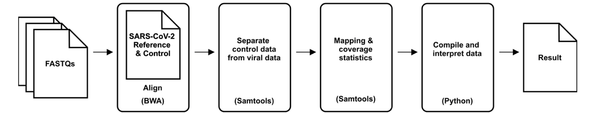

# POLARtron Analysis Pipeline (PAP)

# Contents
* [Installation](#installation)
* [Detailed Guide](#detailed-guide)
   * [Usage and options](#usage-and-options)
   * [Directory structure](#directory_structure)

# Installation

The Polar pipeline and all its dependencies are Linux based, typically running under Linux
operating system, preferably (but not necessarily) on a computer cluster. The included test
set can run on a laptop in under 5 minutes. There are several options for installation, detailed below.


## Install PAP
### Download the PAP repository from Github

```bash
git clone https://github.com/peradastra/PAP.git
```

or...

```bash
curl -sSL -o PAP.zip https://github.com/peradastra/PAP/master.zip && \
mkdir -p PAP && \
unzip PAP.zip -d PAP
```

### Install dependencies to run PAP

If you already have a Anaconda/Miniconda installation then you can create a conda environment using the provided  
environment definition.
1. Create the conda environment
```bash
conda env create -n pap_conda_env -f PAP/pap_conda_env.yml
```

2. Activate PAP conda environment
```bash
conda activate pap_conda_env
```

### Test PAP installation
```bash
cd PAP && \
bash run_pap.sh -d Library001
```

# Detailed Guide

## Usage and options

    Usage: run_pap.sh [-d TOP_DIR] [-t THREADS] -h
            -d  Top level directory which must contain a subdirectory (fastq/) with fastq files
            -t  Number of threads for BWA alignment (Default: 16)
            -h  Print this help and exit

## Directory structure

Place the paired-end sequenced reads in a folder labeled `fastq.` For example, if your experiment is called "Library001", you should have a folder labeled "Library001," and it should contain one subfolder labeled "fastq" with the fastq files in it. The fastqs can be zipped or unzipped, and there can be multiple pairs. This directory structure is shown below in the form of a tree structure.

```
Library001
└── fastq
    ├── library001_R1.fastq.gz
    └── library001_R2.fastq.gz
```

The pipeline will create an "aligned" folder, an "debug" folder and a "final" folder under "Library001." The 
"alignments" folder will contain alignments. The "debug" folder will contain the error and log files. The 
"final" folder will contain the final results of the pipeline. 


```
Library001
├── fastq
│   ├── library001_R1.fastq.gz
│   └── library001_R2.fastq.gz
└── pap
    ├── aligned
    │   ├── all_alignment_stats.txt
    │   ├── classified_alignments.bam
    │   └── viral_alignment_stats.txt
    ├── debug
    │   ├── align.out
    │   ├── all_stats.out
    │   ├── dedup.out
    *   *
    *   *
    *   *
    │   ├── matefix.out
    │   ├── recombo.out
    │   ├── sort.out
    │   └── viral_stats.out
    └── final
        ├── qc_stats.txt
        └── result.csv
```
